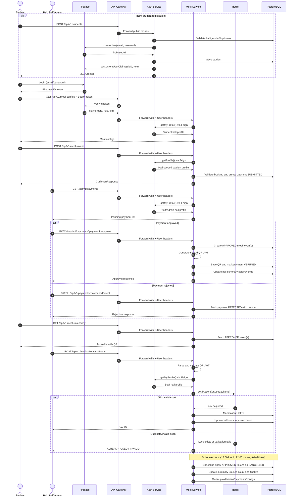

# MBSTU DiningPass - Project Overview

MBSTU DiningPass is a mobile and web-enabled dining management platform for Mawlana Bhashani Science and Technology University (MBSTU). It digitizes the full hall meal lifecycle: student registration, meal booking, payment verification, QR-based meal collection, and hall-level reporting.

The system is designed for four operational roles:
- `STUDENT`
- `HALL_STAFF`
- `HALL_ADMIN`
- `SUPER_ADMIN`

---

## Deployment Links

- Web client (update with your production URL): `TBD`
- API gateway base URL (update with your production URL): `TBD`
- API references: `/docs/APIs/api-reference.md`
- Request/response examples: `/docs/APIs/request-response-reference.md`
- Database schema: `/docs/database/MODELS_SCHEMA.md`

---

## Core User Features

### 1) Secure Authentication and Role-Based Access
- Firebase-backed authentication with custom claims (`dbId`, `role`)
- Gateway-level token verification and trusted header forwarding
- Role-specific access across student, hall staff/admin, and super admin workflows

### 2) Digital Meal Booking and Payment Workflow
- Students cut meal tokens for available meal windows
- Payment proof submission for verification
- Hall staff/admin approval or rejection flow with auditable status transitions

### 3) QR-Based Meal Collection
- Signed QR token generation after payment verification
- Real-time staff scan validation
- One-time token consumption protection with Redis idempotency lock

---

## Other User Features

- Student profile management
- Student payment history and meal token history
- Hall-specific meal visibility for students
- Automatic hall-scoped authorization via profile lookup

---

## Admin Features

- Hall and hall-associate account management
- Meal configuration management (`LUNCH`, `DINNER`)
- Payment queue management (approve/reject)
- Real-time counter scan operations
- Hall meal summary analytics (sold/used/unused/revenue)
- Status control (activate/suspend) for halls and user accounts

---

## Platform and Runtime Features

- API Gateway with centralized authentication enforcement
- Microservice architecture with service boundaries by domain
- Redis caching and lock-based consistency helpers
- Scheduled cleanup and startup catch-up for meal/token lifecycle
- Feign-based service-to-service communication with forwarded auth headers

---

## System Design

### Tech Stack

| Part             | Technology |
|------------------|------------|
| Backend          | Spring Boot (microservices) |
| Frontend         | React (web), planned/optional mobile client integration |
| Database         | PostgreSQL |
| Cache/Lock       | Redis |
| API Security     | Firebase ID Token + API Gateway verification |
| Inter-Service    | OpenFeign |
| Build Tool       | Maven |
| Service Discovery| Eureka (scaffold present) |

---

## Backend Microservices

| Service | Purpose |
|---------|---------|
| `api-gateway` | Verifies Firebase token, injects trusted headers, routes requests |
| `auth-service` | Hall, student, and hall-associate account lifecycle and authorization data |
| `meal-service` | Meal config, token/payment lifecycle, QR scan, summaries, scheduler |
| `eureka-server` | Service discovery scaffold |
| `user-service` | Reserved scaffold for future domain expansion |

---

## Frontend Services

- **User Web Client** (`clients/user`): role-based dashboard and user operations
- **Admin Operations UI**: managed within role-based frontend routes

---

## Key Business Flow (High Level)

```mermaid
flowchart LR
    A[Student Registers] --> B[Firebase Login]
    B --> C[Gateway Verifies Token]
    C --> D[Student Cuts Token]
    D --> E[Payment Submitted]
    E --> F[Hall Staff/Admin Verifies Payment]
    F --> G[QR Generated]
    G --> H[Staff Scans QR]
    H --> I[Token Marked USED]
    I --> J[Hall Summary Updated]
    J --> K[Scheduler Finalizes No-Shows]
```

---

## Full Project Sequence Diagram

--