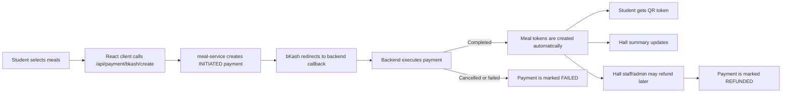
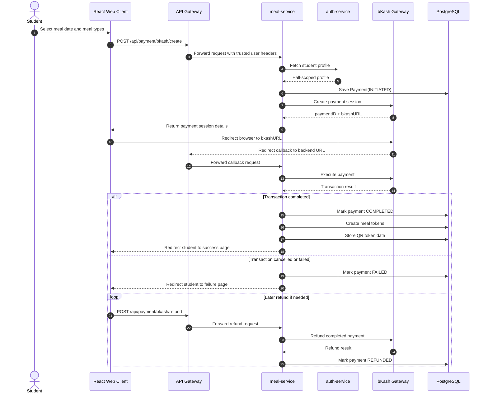

# MBSTU DiningPass

MBSTU DiningPass is a web-enabled dining management platform for Mawlana Bhashani Science and Technology University (MBSTU). It covers student registration, meal booking, bKash payment processing, QR-based meal collection, and hall-level reporting.

## Roles

- `STUDENT`
- `HALL_STAFF`
- `HALL_ADMIN`
- `SUPER_ADMIN`

## What the system does

- Firebase authentication with role-based access
- bKash gateway integration for meal payments
- Automatic token creation after successful payment
- QR token validation for meal collection
- Hall-wide payment history, refunds, and summaries

## Payment flow

1. A student selects meal date and meal types in the React web client.
2. The client calls `POST /api/payment/bkash/create`.
3. The meal service creates a bKash payment session and stores a `Payment` record with status `INITIATED`.
4. bKash redirects the browser to the backend callback URL.
5. The backend executes the payment with bKash.
6. If the transaction is completed, meal tokens are created automatically and the payment becomes `COMPLETED`.
7. Hall staff/admin can refund completed payments through the refund flow.

## Architecture

| Part | Technology |
|---|---|
| Backend | Spring Boot microservices |
| Frontend | React + Vite |
| Database | PostgreSQL |
| Cache/Lock | Redis |
| Security | Firebase ID token + API Gateway verification |
| Service-to-service | OpenFeign |
| Build tool | Maven |

## Services

| Service | Purpose |
|---|---|
| `api-gateway` | Verifies Firebase tokens and forwards trusted user headers |
| `auth-service` | Manages student, hall admin, and hall staff identities |
| `meal-service` | Handles meal configs, bKash payments, QR tokens, and summaries |
| `eureka-server` | Service discovery scaffold |

## bKash configuration

The meal service reads the following environment variables:

- `BKASH_USERNAME`
- `BKASH_PASSWORD`
- `BKASH_API_KEY`
- `BKASH_SECRET_KEY`
- `BKASH_GRANT_TOKEN_URL`
- `BKASH_REFRESH_TOKEN_URL`
- `BKASH_CREATE_PAYMENT_URL`
- `BKASH_EXECUTE_PAYMENT_URL`
- `BKASH_REFUND_URL`
- `BKASH_CALLBACK_URL`

## Payment states

- `INITIATED` — payment session created, waiting for bKash callback
- `COMPLETED` — payment executed successfully and tokens were issued
- `FAILED` — payment was cancelled or did not complete
- `REFUNDED` — a completed payment was refunded

## Frontend flow

- Students start payment from the `Cut Token` screen.
- Successful payments land on the success page with the bKash transaction ID.
- Payment history shows bKash transaction details and current status.
- Hall staff/admin pages show the payment queue and refund actions.
