# MBSTU Dining Pass Backend README

## 1. Overview

This repository contains a microservice-based backend for the MBSTU Dining Pass system.
It supports:
- Registration and identity provisioning using Firebase + local PostgreSQL data
- Role-based operations for `SUPER_ADMIN`, `HALL_ADMIN`, `HALL_STAFF`, and `STUDENT`
- Meal configuration, meal booking (token request), payment verification, QR-based meal collection
- Hall-level summary generation and scheduled daily cleanup

## 2. Service Map

- `services/api-gateway` (port `8080`): entry point, Firebase token verification, routing
- `services/auth-service` (port `8081`): halls, students, hall associates (admin/staff), role/identity data
- `services/meal-service` (port `8082`): meal configs, token/payment lifecycle, QR scan, summary, scheduler
- `services/eureka-server`: discovery service scaffold
- `services/user-service`: scaffold (currently no domain endpoints)

## 3. High-Level Architecture Flow

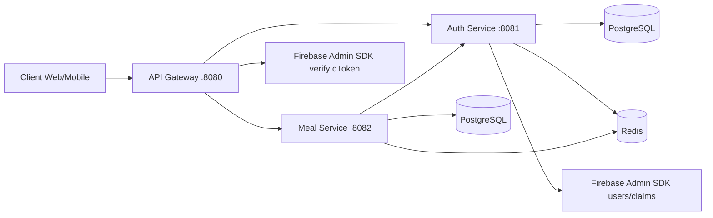

## 4. Authentication and Authorization Model

### 4.1 Token Trust Boundary

1. Client signs in with Firebase Authentication.
2. Client sends Firebase ID token as `Authorization: Bearer <token>` to gateway.
3. Gateway verifies token and injects trusted headers:
   - `X-User-Id` (`dbId` custom claim)
   - `X-User-Role` (`role` custom claim)
   - `X-Firebase-Uid`
4. Downstream services trust these headers and apply business authorization.

### 4.2 Gateway Auth Header Injection Flow

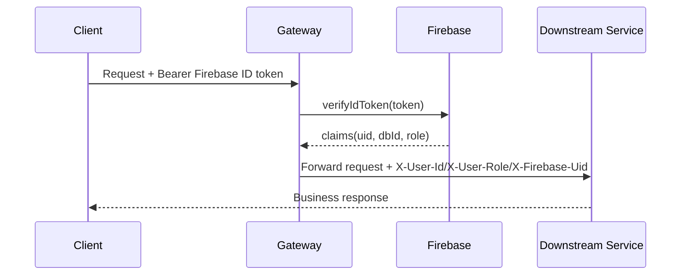

### 4.3 Detailed Authority Authentication Flow (Gateway -> Auth Service)

The following flow merges the detailed behavior from `docs/guide/authority-authentication-flow.md` with the current implementation.

Implementation note (current code):
- Public path bypass in gateway is for `POST /api/v1/students` and `POST /api/v1/students/register`.
- Other paths are treated as protected by `GatewayFirebaseFilter`.

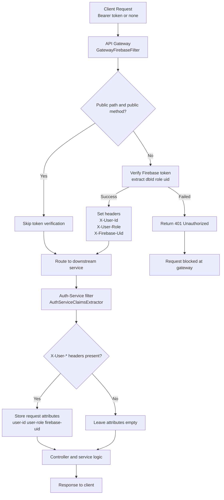

#### Scenario-by-Scenario Verification

##### Scenario 1: Public Path Registration (`POST /api/v1/students/register`)

Request:
```text
POST /api/v1/students/register
(No Authorization header)
```

Expected behavior:
1. Gateway classifies request as public and skips token verification.
2. Gateway forwards request without `X-User-*` headers.
3. `AuthServiceClaimsExtractor` sees missing headers and keeps attributes empty.
4. Registration controller processes body-only request and returns `201` if valid.

##### Scenario 2: Protected Path with Valid Token (`GET /api/v1/admins`)

Request:
```text
GET /api/v1/admins
Authorization: Bearer <valid_firebase_id_token>
```

Expected behavior:
1. Gateway verifies token with Firebase Admin SDK.
2. Gateway extracts custom claims (`dbId`, `role`) and Firebase UID.
3. Gateway injects `X-User-Id`, `X-User-Role`, `X-Firebase-Uid`.
4. Auth filter stores these values as request attributes.
5. Controller/service enforce role and scope rules and return domain response.

##### Scenario 3: Protected Path with Invalid Token

Request:
```text
GET /api/v1/admins
Authorization: Bearer invalid_token
```

Expected behavior:
1. Gateway token verification fails.
2. Gateway returns `401 Unauthorized`.
3. Request never reaches auth-service controller.

##### Scenario 4: Protected Path with Missing Token

Request:
```text
GET /api/v1/admins
(No Authorization header)
```

Expected behavior:
1. Gateway detects missing/malformed Authorization header.
2. Gateway returns `401 Unauthorized`.
3. Request never reaches auth-service controller.

## 5. Registration and Login Flows

## 5.1 Student Registration Flow

Primary endpoint: `POST /api/v1/students`

Business logic:
1. Validate uniqueness (`studentId`, `email`) in auth DB.
2. Validate hall exists and active by `hallShortName`.
3. Validate student gender matches hall gender.
4. Create Firebase user account.
5. Save student in auth DB with Firebase UID.
6. Set Firebase custom claims: `dbId`, `role`.
7. Compensation: if DB/claims step fails, delete created Firebase user.

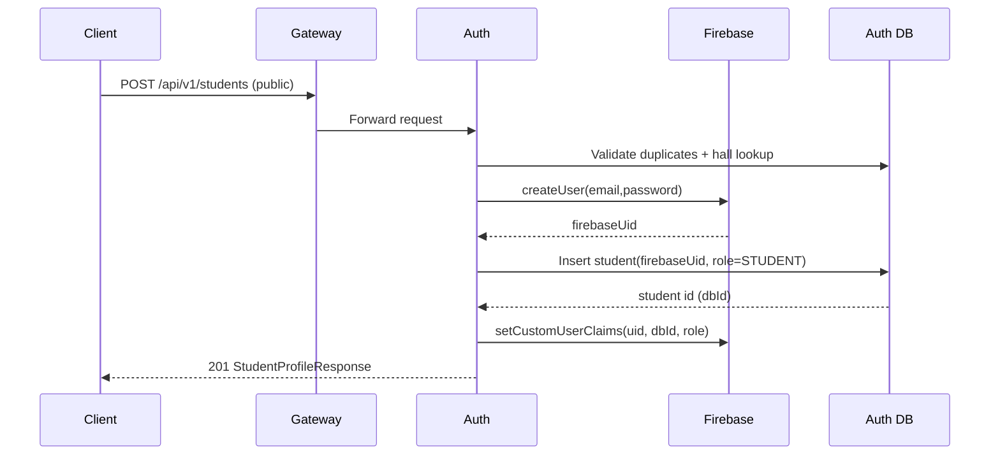

## 5.2 Hall Associate Registration Flow (Admin/Staff)

Primary endpoint: `POST /api/v1/admins` (protected)

Business logic:
- `SUPER_ADMIN` can create `HALL_ADMIN` or `HALL_STAFF`
- `HALL_ADMIN` can create only `HALL_STAFF`
- Hall must exist and be active
- Only one `HALL_ADMIN` per hall
- Same Firebase account + DB + custom-claims provisioning pattern

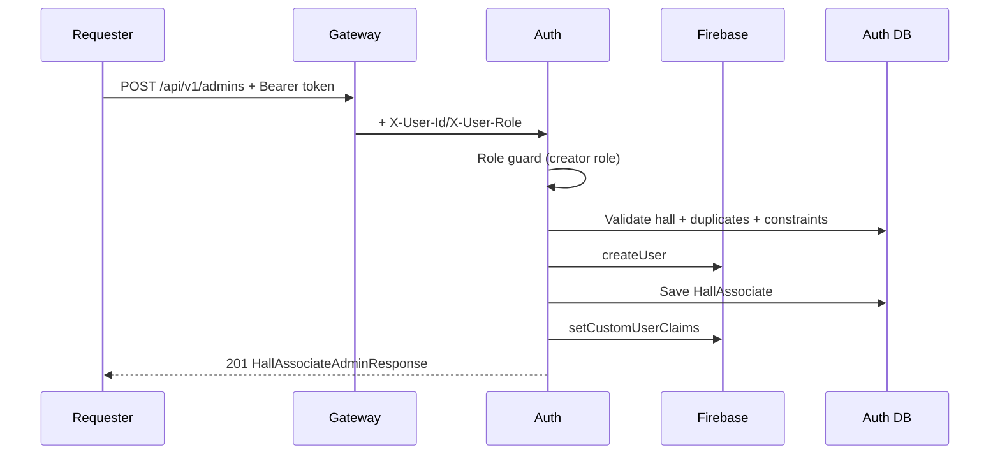

## 5.3 Login Flow

There is no dedicated backend "login" endpoint.
Login is Firebase-managed, and backend identity is resolved by token claims.

Runtime flow:
1. Client logs in directly to Firebase.
2. Client receives Firebase ID token.
3. Client calls backend through gateway with token.
4. Gateway verifies token and forwards trusted headers.
5. Client usually calls profile endpoint (`/api/v1/students/me` or `/api/v1/admins/me`) to hydrate app state.

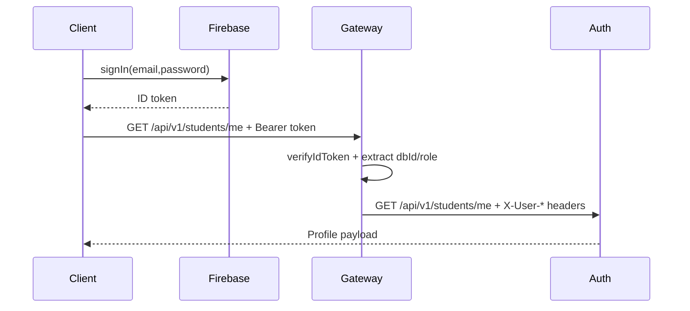

## 6. Auth Service Feature Logic

### 6.1 Hall Management (`/api/v1/halls`)

Features:
- Create hall (`SUPER_ADMIN`)
- Update hall (`SUPER_ADMIN`)
- Suspend/activate hall (`SUPER_ADMIN`)
- List halls (`SUPER_ADMIN`, optional active-only)
- Get hall by id/short name (role-scoped)
- Count active halls (`SUPER_ADMIN`)

Core logic highlights:
- Normalizes short name to uppercase on create/update
- Duplicate checks for full name and short name
- Uses Redis caching for list/count/detail and cache eviction on writes

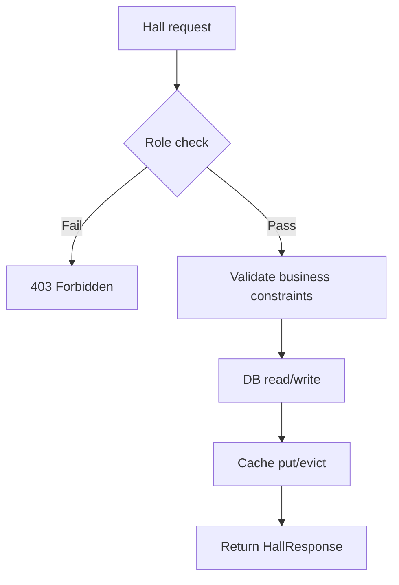

### 6.2 Student Management (`/api/v1/students`)

Features:
- Register student (public create)
- Get/update own profile (`STUDENT`)
- Get paginated students (`SUPER_ADMIN`, `HALL_ADMIN` scoped)
- Suspend/activate student status (`SUPER_ADMIN`, `HALL_ADMIN` with hall scope)

Core logic highlights:
- Registration includes Firebase provisioning + claim setting + compensation rollback
- Suspend/activate attempts Firebase disable/enable too
- Hall-admin operations restricted to own hall

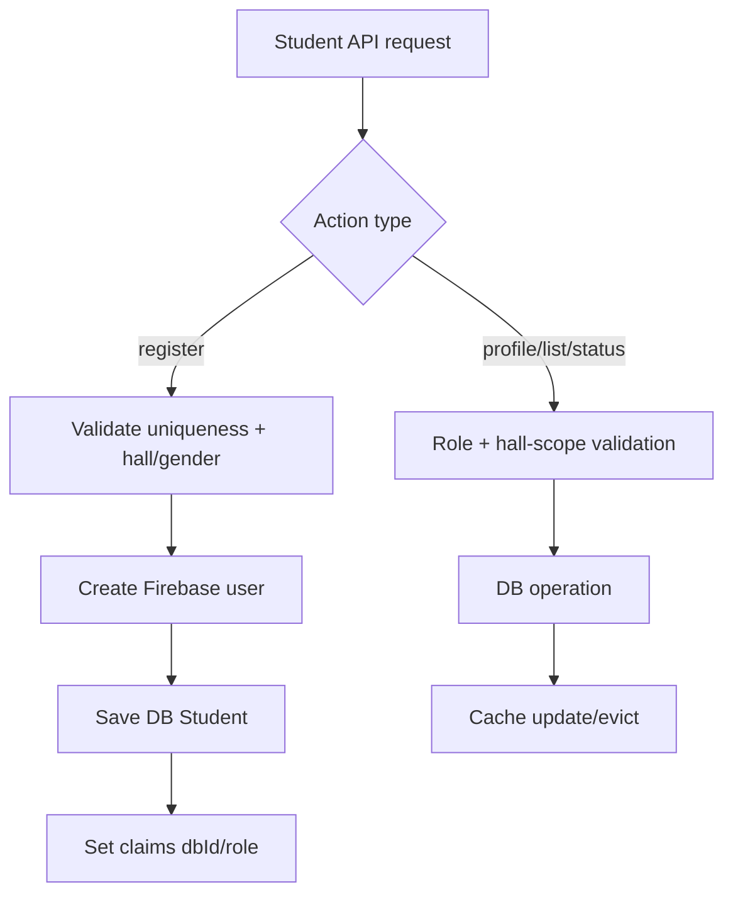

### 6.3 Hall Associate Management (`/api/v1/admins`)

Features:
- Create hall associates (role constrained)
- List accounts by role/hall filters
- Get own profile or get by id (`SUPER_ADMIN`)
- Update own profile
- Count accounts
- Suspend/activate account

Core logic highlights:
- Enforces creator role to target role matrix
- Enforces hall-boundary checks for `HALL_ADMIN`
- Uses Redis profile/list cache keys with role/hall dimensions

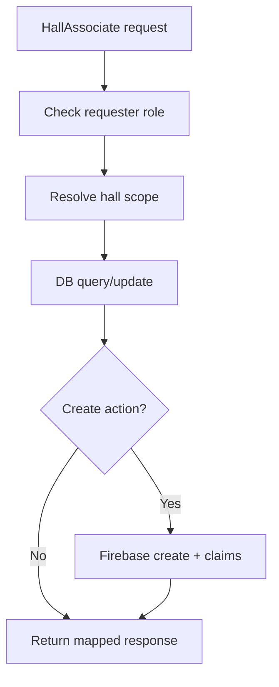

## 7. Meal Service Feature Logic

### 7.1 Meal Config Management (`/api/v1/meal-configs`)

Features:
- Create meal config (`HALL_ADMIN`, `HALL_STAFF`)
- Update meal config (`HALL_ADMIN`, `HALL_STAFF`, same hall only)
- Get all configs:
  - Student view: only active configs for own hall
  - Staff/Admin view: all configs for own hall with admin metrics

Core logic highlights:
- Time validation: `cutTokenBefore < tokenExpires`
- Duplicate prevention by `(hallShortName, mealDate, mealType)`
- Hall-scoped authorization via auth-service profile Feign call
- Redis caching for admin/staff config list; per-hall eviction on write

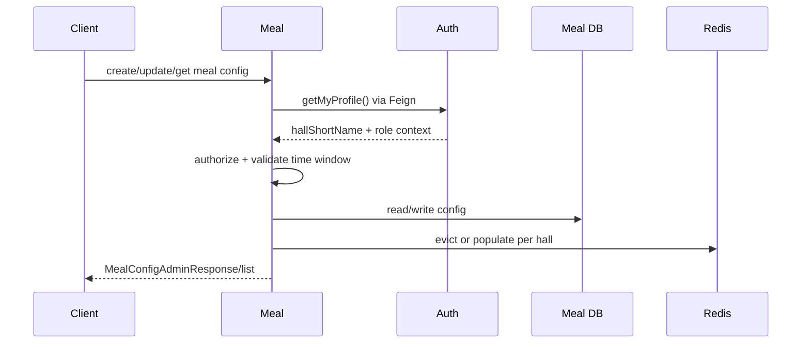

### 7.2 Meal Token Request (Cut Token) (`POST /api/v1/meal-tokens`)

Features:
- Student submits booking request for one or two meal types with payment evidence
- Prevents duplicates against pending/verified payments and existing tokens
- Supports re-submission after rejection by deleting rejected payment records

Core logic highlights:
- Reads student hall from auth-service via Feign
- Validates booking window against meal config cutoff
- Persists a `Payment` record in `SUBMITTED` state (tokens are not created yet)

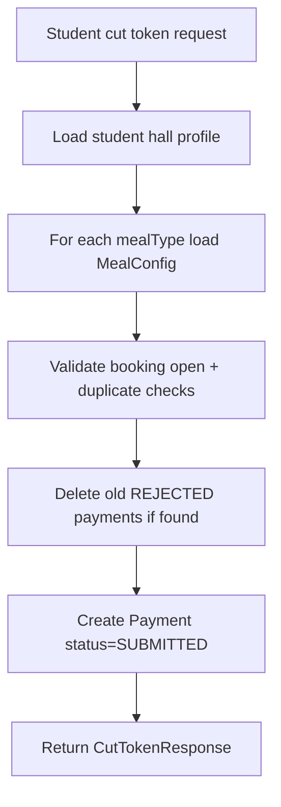

### 7.3 Payment Verification (`/api/v1/payments`)

Features:
- Hall staff/admin lists submitted payments
- Approve payment -> generate tokens + QR data
- Reject payment with reason
- Student views own payment history

Core logic highlights:
- Approve path:
  - Guard status must be `SUBMITTED`
  - Final duplicate token protection
  - Create one `MealToken` per meal type in `APPROVED`
  - Generate signed QR JWT with expiry from meal config
  - Update meal config sold counter
  - Update hall summary sold/revenue
  - Mark payment `VERIFIED`
- Reject path sets status `REJECTED` with reason

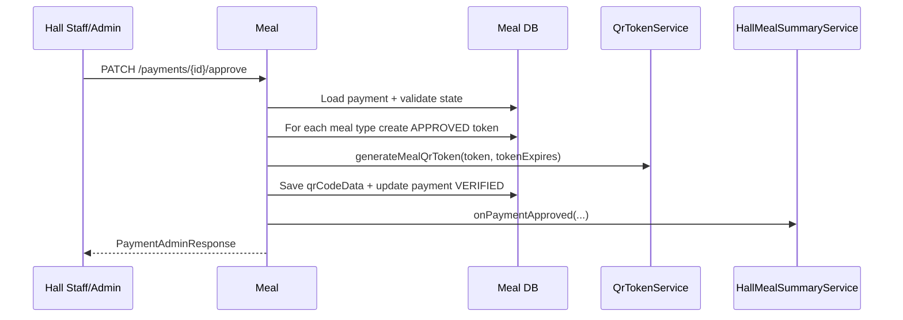

### 7.4 QR Scan (Staff Mode) (`POST /api/v1/meal-tokens/staff-scan`)

Features:
- Counter staff scans student QR and validates token
- Prevents cross-hall and wrong-date use
- Prevents duplicate collection via Redis idempotency key
- Marks token used and updates hall summary used count

Core logic highlights:
- QR JWT parse/signature/expiry validation
- Must match staff hall and today in `Asia/Dhaka`
- Token status must be `APPROVED`
- State transition: `APPROVED -> USED`

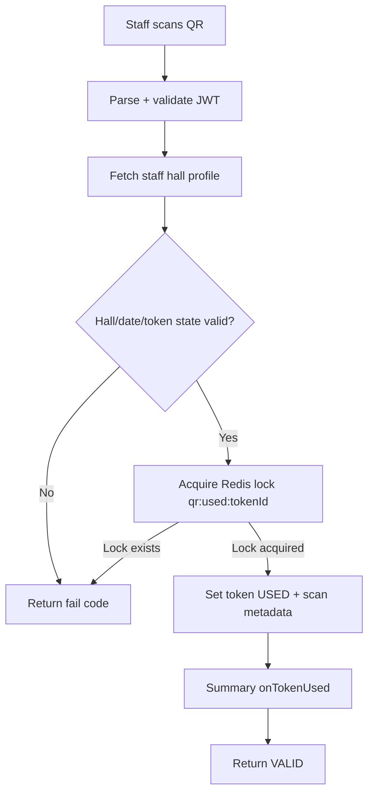

### 7.5 Hall Meal Summary (`GET /api/v1/summary`)

Features:
- Hall staff/admin get paginated hall summary
- Data always scoped to requester's hall
- Sorted by meal date and meal type

Counter update sources:
- `onPaymentApproved` -> sold/revenue
- `onTokenUsed` -> used
- `onTokenExpired` -> unused

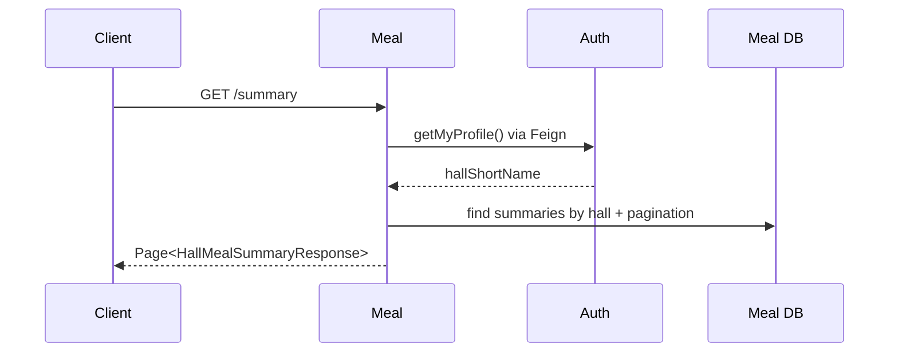

### 7.6 Scheduler and Cleanup Logic

Scheduler jobs (`Asia/Dhaka`):
- Lunch cleanup at `15:00`
- Dinner cleanup at `22:00`

Cleanup process:
1. Find halls with tokens for `(date, mealType)`.
2. Skip hall if summary already finalized.
3. Convert no-show tokens (`APPROVED`) to `CANCELLED`.
4. Increment summary unused count for each no-show.
5. Finalize summary row (`isFinalized=true`, `finalizedAt`).
6. Delete tokens for date+meal.
7. Dinner-only: delete payments for that date.
8. Delete expired meal configs and evict cache.

Startup catch-up:
- On service startup, re-runs any missed cleanups for today/yesterday and older orphaned records.

```mermaid
flowchart TD
    A[@Scheduled / startup catch-up] --> B[cleanupIfNotDone(date, mealType)]
    B --> C[Find halls with tokens]
    C --> D[Per hall: if not finalized]
    D --> E[Mark APPROVED no-shows as CANCELLED]
    E --> F[Summary onTokenExpired + finalize]
    F --> G[Delete tokens by date+meal]
    G --> H{mealType == DINNER?}
    H -->|Yes| I[Delete payments by date]
    H -->|No| J[Skip payment deletion]
    I --> K[Delete expired meal configs + cache evict]
    J --> K
```

## 8. End-to-End Business Journey

```mermaid
flowchart LR
    A[Student registers] --> B[Student logs in via Firebase]
    B --> C[Hall admin/staff creates meal configs]
    C --> D[Student submits cut token/payment]
    D --> E[Hall staff/admin verifies payment]
    E --> F[Meal tokens + QR generated]
    F --> G[Student appears at counter]
    G --> H[Staff scans QR]
    H --> I[Token used + summary updated]
    I --> J[Daily scheduler finalizes no-shows]
```

## 9. Current State of Each Backend Service

- `api-gateway`: active and central to security context propagation
- `auth-service`: fully functional for hall/student/associate domains
- `meal-service`: fully functional for config-payment-token-QR-summary lifecycle + scheduler
- `eureka-server`: scaffold present; runtime configuration appears minimal in current files
- `user-service`: scaffold only (`UserServiceApplication`), no domain API yet

## 10. Important Implementation Notes

- Backend login is token-validation based, not session-login based.
- Gateway is the trust anchor for authentication headers.
- Downstream services generally use `permitAll` at Spring Security layer and enforce authorization in service logic.
- Feign interceptor forwards `X-User-Id` and `X-User-Role` to auth-service for profile-based hall scoping.
- Redis is used for:
  - cached list/profile responses
  - QR idempotency lock
  - meal-config list caching and eviction

## 11. Run Order (Development)

Based on current service route/port configuration:
1. `eureka-server` (if discovery integration is enabled in your runtime)
2. `auth-service` (`8081`)
3. `meal-service` (`8082`)
4. `api-gateway` (`8080`)

Example service startup commands:

```bash
cd /home/alamgir/Alamgir/workingProject/MBSTU_DiningPass/services/auth-service
./mvnw spring-boot:run

cd /home/alamgir/Alamgir/workingProject/MBSTU_DiningPass/services/meal-service
./mvnw spring-boot:run

cd /home/alamgir/Alamgir/workingProject/MBSTU_DiningPass/services/api-gateway
./mvnw spring-boot:run
```

## 12. API Surface Snapshot

### Auth Service
- `POST /api/v1/students`
- `GET /api/v1/students/me`
- `PUT /api/v1/students/me`
- `GET /api/v1/students`
- `PATCH /api/v1/students/{id}/status`
- `POST /api/v1/admins`
- `GET /api/v1/admins`
- `GET /api/v1/admins/me`
- `GET /api/v1/admins/{id}`
- `PUT /api/v1/admins/me`
- `PATCH /api/v1/admins/{id}/status`
- `GET /api/v1/admins/count`
- `POST /api/v1/halls`
- `PUT /api/v1/halls/{id}`
- `GET /api/v1/halls`
- `GET /api/v1/halls/{id}`
- `GET /api/v1/halls/short-name/{shortName}`
- `PATCH /api/v1/halls/{id}/status`
- `GET /api/v1/halls/count`

### Meal Service
- `POST /api/v1/meal-configs`
- `GET /api/v1/meal-configs`
- `PUT /api/v1/meal-configs/{configId}`
- `POST /api/v1/meal-tokens`
- `GET /api/v1/meal-tokens/my`
- `POST /api/v1/meal-tokens/staff-scan`
- `PATCH /api/v1/payments/{id}/approve`
- `PATCH /api/v1/payments/{id}/reject`
- `GET /api/v1/payments`
- `GET /api/v1/payments/my`
- `GET /api/v1/summary`
- `GET /api/v1/summary/hall`

---

This README is derived from the current backend source code under `services/*` and reflects the implementation as of the repository state reviewed.

