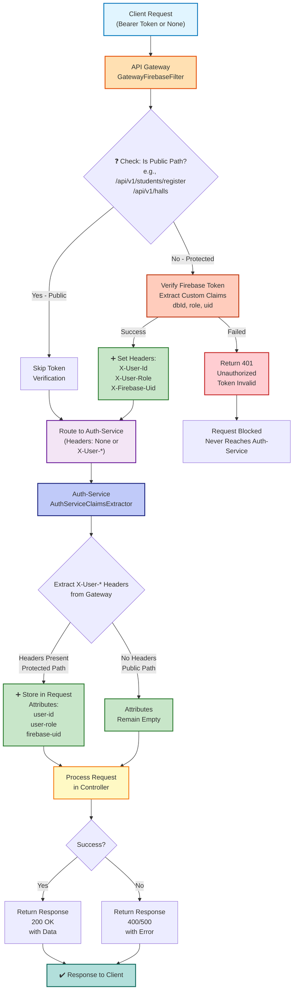

#  Single Authority Authentication - Flowchart Diagram


## Flowchart




---

## Scenario-by-Scenario Verification

### Scenario 1: Public Path (/api/v1/students/register)

**Request**:

```
POST /api/v1/students/register
(No Authorization header)
```

**Gateway Flow**:

```
1. Check: "/api/v1/students/register" in PUBLIC_PATHS? YES 
2. Action: Skip token verification
3. Action: Do NOT set X-User-* headers
4. Result: Forward as-is
Status:  CORRECT
```

**Auth-Service Flow**:

```
1. Extract X-User-Id: NULL (not set)
2. Extract X-User-Role: NULL (not set)
3. Extract X-Firebase-Uid: NULL (not set)
4. Store attributes: None (all NULL)
5. Continue to controller
Status:  CORRECT
```

**Controller Flow**:

```
1. No @RequestHeader annotations
2. Process registration
3. Return 201 Created
Status:  CORRECT
```

**Result**:  PUBLIC PATH WORKS

---

### Scenario 2: Protected Path with Valid Token (/api/v1/admin/accounts)

**Request**:

```
GET /api/v1/admin/accounts
Authorization: Bearer eyJhbGc...valid...
```

**Gateway Flow**:

```
1. Check: "/api/v1/admin/accounts" in PUBLIC_PATHS? NO
2. Extract: "Bearer eyJhbGc...valid..."
3. Extract token: "eyJhbGc...valid...
4. Verify: FirebaseAuth.verifyIdToken() → Success 
5. Extract claims:
   - dbId = "550e8400-e29b-41d4-a716-446655440000"
   - role = "SUPER_ADMIN"
6. Validate: dbId != null && role != null? YES 
7. Set headers:
   - X-User-Id: "550e8400-..."
   - X-User-Role: "SUPER_ADMIN"
   - X-Firebase-Uid: "firebase_uid_123"
8. Forward with headers
Status:  CORRECT
```

**Auth-Service Flow**:

```
1. Extract X-User-Id: "550e8400-..."  
2. Extract X-User-Role: "SUPER_ADMIN" 
3. Extract X-Firebase-Uid: "firebase_uid_123" 
4. Store attributes:
   - "user-id" = "550e8400-..."
   - "user-role" = "SUPER_ADMIN"
   - "firebase-uid" = "firebase_uid_123"
5. Continue to controller
Status:  CORRECT
```

**Controller Flow**:

```
public ResponseEntity<List<AdminResponse>> getAllAdmins(
    @RequestHeader("X-User-Role") String role
) {
    // role = "SUPER_ADMIN" 
    return ResponseEntity.ok(adminService.getAllAdmin());
}
Status:  CORRECT
```

**Result**:  PROTECTED PATH WITH VALID TOKEN WORKS

---

### Scenario 3: Protected Path with Invalid Token

**Request**:

```
GET /api/v1/admin/accounts
Authorization: Bearer invalid_token
```

**Gateway Flow**:

```
1. Check: "/api/v1/admin/accounts" in PUBLIC_PATHS? NO
2. Extract: "Bearer invalid_token"
3. Extract token: "invalid_token"
4. Verify: FirebaseAuth.verifyIdToken() → Exception ✗
5. Catch FirebaseAuthException 
6. Log: "Firebase token verification failed"
7. Set status: 401 Unauthorized
8. Return response.setComplete()
9. Block request
Status:  CORRECT
```

**Auth-Service**:

```
 Never receives request (blocked by gateway)
Status: CORRECT
```

**Controller**:

```
 Never receives request (blocked by gateway)
Status: CORRECT
```

**Client Receives**:

```
401 Unauthorized
Status:  CORRECT
```

**Result**:  INVALID TOKEN BLOCKED CORRECTLY

---

### Scenario 4: Protected Path with Missing Token

**Request**:

```
GET /api/v1/admin/accounts
(No Authorization header)
```

**Gateway Flow**:

```
1. Check: "/api/v1/admin/accounts" in PUBLIC_PATHS? NO
2. Extract: Authorization header → NULL
3. Check: authHeader == null || !startsWith("Bearer ")? YES 
4. Log: "Missing or malformed Authorization header"
5. Set status: 401 Unauthorized
6. Return response.setComplete()
7. Block request
Status:  CORRECT
```

**Auth-Service**:

```
 Never receives request (blocked by gateway)
Status:  CORRECT
```

**Controller**:

```
Never receives request (blocked by gateway)
Status:  CORRECT
```

**Client Receives**:

```
401 Unauthorized
Status:  CORRECT
```

**Result**:  MISSING TOKEN BLOCKED CORRECTLY
